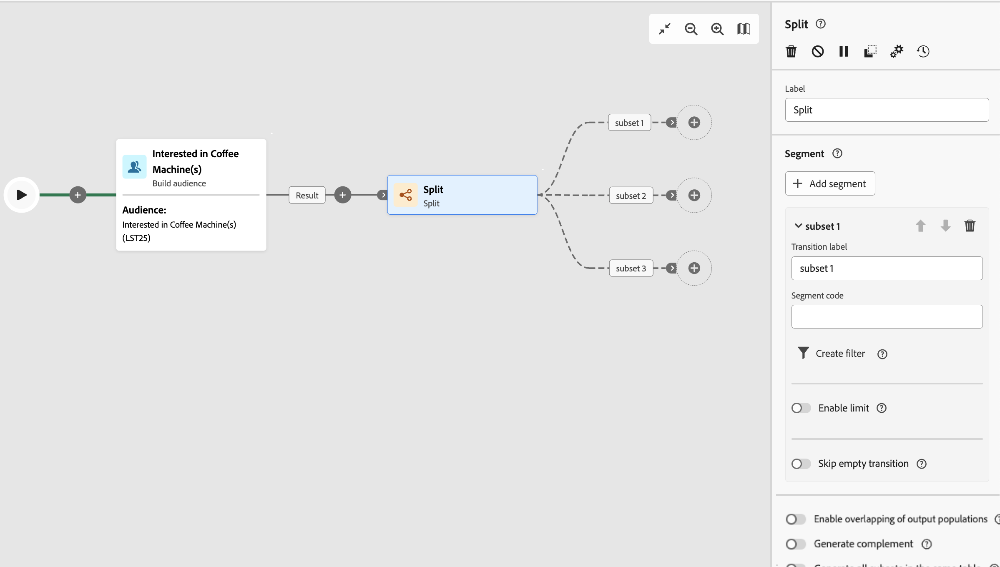

# Dividi {#split}

>[!CONTEXTUALHELP]
>id="acw_orchestration_split"
>title="Attività Dividi"
>abstract="L’attività **Dividi** consente di segmentare le popolazioni in ingresso in più sottoinsiemi in base a criteri di selezione diversi, ad esempio le regole di filtro o le dimensioni della popolazione."

L&#39;attività **Split** è un&#39;attività **Targeting** che segmenta le popolazioni in ingresso in più sottoinsiemi in base a criteri di selezione diversi, ad esempio regole di filtro o dimensioni della popolazione.

## Configurare l’attività Dividi {#split-configuration}

>[!CONTEXTUALHELP]
>id="acw_orchestration_split_segments"
>title="Segmenti per attività Dividi"
>abstract="Aggiungi tutti i sottoinsiemi desiderati per segmentare la popolazione in ingresso. Quando l&#39;attività **Split** viene eseguita, il gruppo viene segmentato tra i diversi sottoinsiemi nell&#39;ordine in cui vengono aggiunti all&#39;attività. Prima di avviare il flusso di lavoro, assicurati di aver ordinato i sottoinsiemi nell’ordine più adatto alle tue esigenze utilizzando i pulsanti freccia."

>[!CONTEXTUALHELP]
>id="acw_orchestration_split_filter"
>title="Filtro attività Dividi"
>abstract="Per applicare una condizione di filtro al sottoinsieme, fai clic su **[!UICONTROL Crea filtro]** e configura la regola di filtro desiderata utiizzando il query modeler. Ad esempio, includi i profili della popolazione in ingresso il cui indirizzo e-mail esiste nel database."
>additional-url="https://experienceleague.adobe.com/it/docs/campaign-web/v8/query-database/query-modeler-overview" text="Utilizzo del query modeler"

>[!CONTEXTUALHELP]
>id="acw_orchestration_split_limit"
>title="Limite attività Dividi"
>abstract="Per limitare il numero di profili selezionati dal sottoinsieme, attiva l’opzione **[!UICONTROL Abilita limite]** e specifica il numero o le percentuali della popolazione da includere."

>[!CONTEXTUALHELP]
>id="acw_orchestration_split_sorting"
>title="Ordinamento attività Dividi"
>abstract="Quando imposti un limite di popolazione per un sottoinsieme, puoi classificare i profili selezionati in base a un attributo di profilo specifico, in ordine crescente o decrescente. A tale scopo, attiva l’opzione **Abilita ordinamento**. Ad esempio, puoi limitare un sottoinsieme in modo da includere solo i primi 50 profili con l’importo di acquisto più alto."

>[!CONTEXTUALHELP]
>id="acw_orchestration_split_complement"
>title="Complemento generato da suddivisione"
>abstract="Dopo aver configurato tutti i sottoinsiemi, puoi selezionare la popolazione rimanente che non corrisponde a nessuno dei sottoinsiemi e includerli in un’ulteriore transizione in uscita. A tale scopo, attiva l’opzione **Genera complemento**."

>[!CONTEXTUALHELP]
>id="acw_orchestration_split_generatesubsets"
>title="Genera tutti i sottoinsiemi nella stessa tabella"
>abstract="Attiva questa opzione per raggruppare tutti i sottoinsiemi in una singola transizione di output."

>[!CONTEXTUALHELP]
>id="acw_orchestration_split_emptytransition"
>title="Ignora transizione vuota"
>abstract="Attiva l’opzione **[!UICONTROL Ignora transizione vuota]** per disabilitare la transizione di output per questo sottoinsieme se la popolazione in ingresso è vuota."

>[!CONTEXTUALHELP]
>id="acw_orchestration_split_enable_overlapping"
>title="Abilita sovrapposizione popolazioni di output"
>abstract="L’opzione **[!UICONTROL Abilita sovrapposizione popolazioni di output]** consente di gestire le popolazioni appartenenti a diversi sottoinsiemi. Quando la casella non è selezionata, l’attività di suddivisione fa sì che un destinatario non possa essere presente in diverse transizioni di output, anche se soddisfa i criteri di diversi sottoinsiemi. Saranno nella destinazione della prima scheda con i criteri corrispondenti. Quando questa opzione è selezionata, i destinatari possono essere in più sottoinsiemi se soddisfano i rispettivi criteri di filtro. Adobe Campaign consiglia di usare criteri esclusivi."

Per configurare l’attività **Dividi** segui questi passaggi:

1. Aggiungi un’attività **Dividi** al flusso di lavoro.

1. Il riquadro di configurazione dell’attività si apre con un sottoinsieme predefinito. Fai clic sul pulsante **Aggiungi segmento** per aggiungere tutti i sottoinsiemi desiderati per segmentare la popolazione in ingresso.

   

   >[!IMPORTANT]
   >
   >Quando l&#39;attività **Split** viene eseguita, il gruppo viene segmentato tra i diversi sottoinsiemi nell&#39;ordine in cui vengono aggiunti all&#39;attività. Ad esempio, se il primo sottoinsieme recupera il 70% della popolazione iniziale, il sottoinsieme aggiunto successivamente applicherà i propri criteri di selezione solo al restante 30% e così via.
   >
   >Prima di avviare il flusso di lavoro, assicurati di aver ordinato i sottoinsiemi nell’ordine più adatto alle tue esigenze. Utilizzare i pulsanti freccia per modificare la posizione di un sottoinsieme.

1. Una volta aggiunti i sottoinsiemi, l’attività mostra tante transizioni di output quanti sono i sottoinsiemi. Modifica l’etichetta di ciascun sottoinsieme per identificarlo facilmente nell’area di lavoro del flusso di lavoro.

1. Configura in che modo ogni sottoinsieme filtra la popolazione in ingresso. Segui questi passaggi:

   1. Apri il sottoinsieme per visualizzarne le proprietà.

   1. Per applicare una condizione di filtro al sottoinsieme, fai clic su **[!UICONTROL Crea filtro]** e configura la regola di filtro desiderata utiizzando il query modeler. Ad esempio, includi i profili della popolazione in ingresso il cui indirizzo e-mail esiste nel database. [Scopri come utilizzare Query Modeler](../../query/query-modeler-overview.md).

   1. Per limitare il numero di profili selezionati dal sottoinsieme, attiva l’opzione **[!UICONTROL Abilita limite]** e specifica il numero o le percentuali della popolazione da includere.

   1. Per disabilitare una transizione se il gruppo in ingresso è vuoto, attiva l&#39;opzione **[!UICONTROL Ignora transizione vuota]**. Se nessun profilo corrisponde al sottoinsieme, il flusso di lavoro non passerà all’attività successiva.

      

      >[!NOTE]
      >
      >Quando si imposta un limite di popolazione per un sottoinsieme, è possibile classificare i profili selezionati in base a un attributo di profilo [specifico](../../get-started/attributes.md), in ordine crescente o decrescente. A tale scopo, attiva l’opzione **[!UICONTROL Abilita ordinamento]**. Ad esempio, puoi limitare un sottoinsieme in modo da includere solo i primi 50 profili con l’importo di acquisto più alto.

1. Dopo aver configurato tutti i sottoinsiemi, puoi selezionare la popolazione rimanente che non corrisponde a nessuno dei sottoinsiemi e includerli in un’ulteriore transizione in uscita. A tale scopo, attiva l’opzione **[!UICONTROL Genera complemento]**.

   

   >[!NOTE]
   >
   >L&#39;opzione **[!UICONTROL Genera tutti i sottoinsiemi nella stessa tabella]** consente di raggruppare tutti i sottoinsiemi in un&#39;unica transizione di output.

1. L&#39;opzione **[!UICONTROL Abilita la sovrapposizione delle popolazioni di output]** consente di gestire le popolazioni appartenenti a diversi sottoinsiemi:

   * Quando la casella non è selezionata, l’attività di suddivisione fa sì che un destinatario non possa essere presente in diverse transizioni di output, anche se soddisfa i criteri di diversi sottoinsiemi. Saranno nel target della prima scheda con criteri corrispondenti.
   * Quando questa opzione è selezionata, i destinatari possono essere in più sottoinsiemi se soddisfano i rispettivi criteri di filtro. Adobe Campaign consiglia di usare criteri esclusivi.

L’attività adesso è configurata. Durante l’esecuzione del flusso di lavoro, il gruppo segmenta i diversi sottoinsiemi nell’ordine in cui sono stati aggiunti all’attività.

## Esempio {#split-example}

Nell&#39;esempio seguente, l&#39;attività **[!UICONTROL Dividi]** segmenta un pubblico in sottoinsiemi distinti in base al canale di comunicazione da utilizzare:

* **Sottoinsieme 1 &quot;push&quot;**: questo sottoinsieme comprende tutti i profili che hanno installato l&#39;app mobile.
* **Sottoinsieme 2 &quot;sms&quot;**: utenti di telefoni cellulari: per la popolazione rimanente che non rientra nel Sottoinsieme 1, il Sottoinsieme 2 applica una regola di filtro per selezionare profili con telefoni cellulari nel database.
* **Transizione del complemento**: questa transizione acquisisce tutti i profili rimanenti che non corrispondono al sottoinsieme 1 o al sottoinsieme 2. In particolare, include i profili che non hanno installato l’app mobile e non dispongono di un telefono cellulare, ad esempio gli utenti che non hanno installato l’app mobile o non dispongono di un numero di cellulare registrato.

