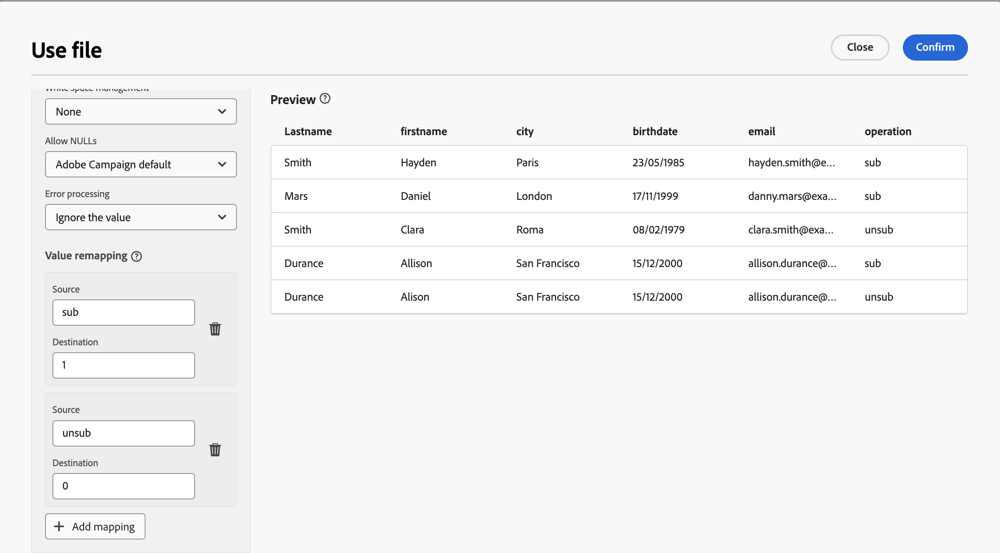

# Servizi di abbonamento {#subscriptipon-services}

>[!CONTEXTUALHELP]
>id="acw_orchestration_subscription"
>title="Attività dei servizi di iscrizione"
>abstract="L’attività Servizi di iscrizione consente a più profili di effettuare l’iscrizione a un servizio o annullarla, in un’unica azione."

>[!CONTEXTUALHELP]
>id="acw_orchestration_subscription_general"
>title="Parametri dei servizi di iscrizione"
>abstract="Scegli il servizio desiderato e scegli l’azione da eseguire (iscrizione o annullamento dell’iscrizione). Attiva l’opzione **Invia messaggio di conferma** per notificare alla popolazione l’iscrizione o l’annullamento dell’iscrizione al servizio selezionato."

>[!CONTEXTUALHELP]
>id="acw_orchestration_subscription_outboundtransition"
>title="Genera una transizione in uscita"
>abstract="Attiva/disattiva l’opzione **Genera una transizione in uscita** per aggiungere una transizione dopo l’attività."

Il **Servizi di abbonamento** l&#39;attività è un **Gestione dati** attività. Consente di creare o eliminare un abbonamento a un servizio di informazioni per la popolazione specificata nella transizione.

## Configurare l’attività Subscription services {#subscription-services-configuration}

Per configurare il **Servizi di abbonamento** attività:

1. Aggiungi un **Servizi di abbonamento** attività nel flusso di lavoro. Puoi utilizzare questa attività dopo il targeting dei profili o l’importazione di un file con dati identificati.

1. Seleziona il servizio per il quale desideri gestire gli abbonamenti utilizzando una delle seguenti opzioni:

   * **[!UICONTROL Seleziona un servizio specifico]**: seleziona manualmente un servizio utilizzando **[!UICONTROL Servizio]** campo.

   * **[!UICONTROL Da transizione in entrata]**: utilizza il servizio specificato nella transizione in entrata. Ad esempio, puoi importare un file che specifica il servizio da gestire per ogni riga. Il servizio su cui eseguire l’operazione viene quindi selezionato dinamicamente per ciascun profilo.

   

1. Selezionare l&#39;operazione da eseguire: **Abbonati** o **Annulla iscrizione**.

   Se il servizio è definito nella transizione in entrata, puoi scegliere come recuperare questa operazione:

   * **Seleziona un tipo di operazione specifico**: seleziona manualmente l’operazione da eseguire (**Abbonati** o **Annulla iscrizione**)

   * **Seleziona un tipo di operazione da un percorso di transizione in entrata**: seleziona la colonna dei dati in entrata che specifica l’operazione da eseguire per ogni record. Ad esempio, è possibile importare un file che specifica l&#39;operazione da eseguire per ogni riga di una colonna &quot;operazione&quot;.

     >[!NOTE]
     >
     >Qui è possibile selezionare solo campi booleani o interi. Assicurati che i dati contenenti l’operazione da eseguire corrispondano a questo formato. Ad esempio, se carichi i dati da un’attività Load file, verifica di aver impostato correttamente il formato della colonna contenente l’operazione nell’ **[!UICONTROL Carica file]** attività. Un esempio è presentato in [questa sezione](#uc2).

   

1. Per notificare ai destinatari l’abbonamento o il suo annullamento al servizio selezionato, attiva/disattiva **[!UICONTROL Invia un messaggio di conferma]** opzione attivata. Il contenuto di questa notifica è definito in un modello di consegna associato al servizio informazioni.

1. Se utilizzi dati da una transizione in entrata, un’ **[!UICONTROL Informazioni aggiuntive]** viene visualizzata la sezione, che consente di specificare i dati e l’origine dell’abbonamento per ciascun record. Puoi lasciare vuota questa sezione, nel qual caso non verrà impostata alcuna data o origine durante l’esecuzione del flusso di lavoro.

   * Se i dati in entrata contengono una colonna che indica la data di abbonamento del profilo al servizio, puoi selezionarla in **[!UICONTROL Data]** campo.

   * In **[!UICONTROL Percorso origine]** , definisci l’origine dell’abbonamento. Puoi impostarlo su uno dei campi dei dati in entrata o su un valore costante desiderato selezionando la **[!UICONTROL Imposta una costante come origine]** opzione.

   

1. Per aggiungere una transizione in uscita dopo l’attività, imposta il **[!UICONTROL Generare una transizione in uscita]** opzione attivata.

## Esempi {#example}

### Iscrizione di un pubblico a un servizio specifico {#uc1}

Questo flusso di lavoro seguente mostra come abbonare un pubblico a un servizio esistente.


* A **[!UICONTROL Creare un pubblico]** l’attività esegue il targeting di un pubblico esistente.

* A **[!UICONTROL Subscription Services]** attività ti consente di selezionare il servizio a cui i profili devono effettuare l’abbonamento.

<!--
### Updating multiple subscription statuses from a file {#uc2}

The workflow below shows how to import a file containing profiles and update their subscription to several services specified in the file.


* A **[!UICONTROL Load file]** activity loads a CSV file containing the data and defines the structure of the imported columns. The "service" and "operation" columns specify the service to update and the operation to perform (subscription or unsubscription).

  ```
  Lastname,firstname,city,birthdate,email,service,operation
  Smith,Hayden,Paris,23/05/1985,hayden.smith@example.com,yoga,sub
  Mars,Daniel,London,17/11/1999,danny.mars@example.com,running,sub
  Smith,Clara,Roma,08/02/1979,clara.smith@example.com,running,unsub
  Durance,Allison,San Francisco,15/12/2000,allison.durance@example.com,yoga,sub
  Durance,Alison,San Francisco,15/12/2000,allison.durance@example.com,running,unsub
  ```

  As you may have noticed, the operation is specified in the file as "sub" or "unsub". The system expects a **Boolean** or **Integer** value to recognize the operation to perform: "0" to unsubscribe and "1" to subscribe. To match this requirement, a remapping of values must be performed in the detail of the "operation" column in the sample file configuration screen.

  

  If your file already uses "0" and "1" to identify the operation, you don't need to remap those values. Only make sure that the column is processed as a **Boolean** or **Integer** in the sample file columns.

* A **[!UICONTROL Reconciliation]** activity identifies the data from the file as belonging to the profile dimension of the Adobe Campaign database. The **email** field of the file is matched to the **email** field of the profile resource.

  

* An **[!UICONTROL Enrichment]** activity creates a link to the "Services (nms)" table and creates a simple join between the "service" column of the uploaded file, and the services "internal name" field in the database.

    

* A **[!UICONTROL Deduplication]** based on the **email** field identifies duplicates. It is important to eliminate duplicates since the subscription to a service will fail for all data in case of duplicates.

  
  
* A **[!UICONTROL Subscription Services]** identifies the services to update as coming from the transition, through the link created in the **[!UICONTROL Reconciliation]** activity.

  The **[!UICONTROL Operation type]** is identified as coming from the **operation** field of the file. Only Boolean or Integer fields can be selected here. If the column of your file that contains the operation to perform does not appear in the list, make sure that you have correctly set your column format in the **[!UICONTROL Load file]** activity, as explained earlier in this example.

  -->
