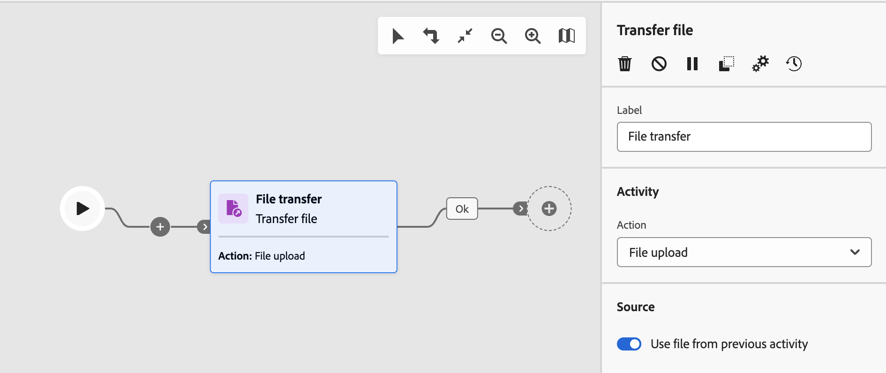
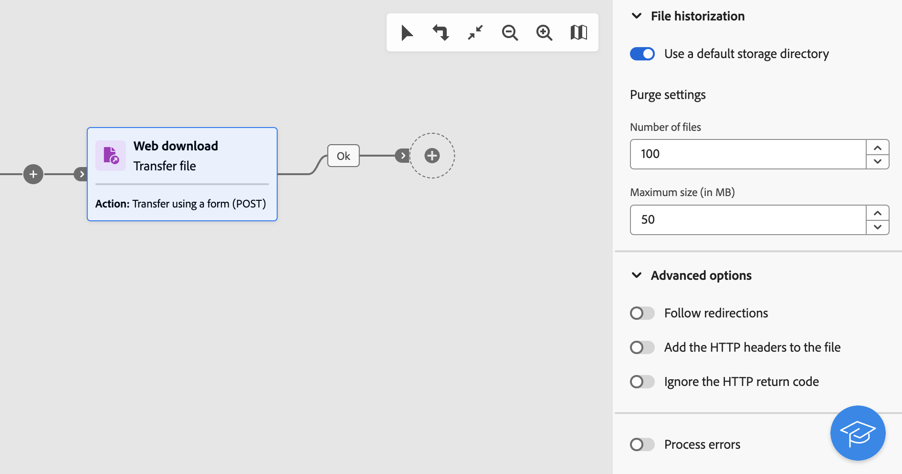

# Trasferimento file {#transfer-file}

>[!CONTEXTUALHELP]
>id="acw_orchestration_transferfile"
>title="Trasferimento file"
>abstract="L’attività **Trasferimento file** consente di ricevere o inviare file, verificare la presenza di file o elencarli su un server. Il protocollo utilizzato può essere un protocollo da server a server o HTTP."

>[!CONTEXTUALHELP]
>id="acw_orchestration_transferfile_options"
>title="Opzioni di trasferimento file"
>abstract="Opzioni di trasferimento file"

>[!CONTEXTUALHELP]
>id="acw_orchestration_transferfile_activity"
>title="Attività Estrarre file"
>abstract="Attività Estrarre file"

>[!CONTEXTUALHELP]
>id="acw_orchestration_transferfile_remoteserver"
>title="Trasferimento file su server remoto"
>abstract="Specifica il server da connettere."

>[!CONTEXTUALHELP]
>id="acw_orchestration_transferfile_source"
>title="Trasferimento origine file"
>abstract="Immetti il nome file desiderato."

L&#39;attività **Transfer file** è un&#39;attività **Data Management**. Consente di ricevere o inviare file, verificare la presenza di file o elencarli su un server. Il protocollo utilizzato può essere un protocollo da server a server o HTTP.

>[!NOTE]
>
>Con l&#39;interfaccia utente di Campaign Web, due attività sono state consolidate in una unendo le funzionalità **Trasferimento file** e **Download Web**. Questo consolidamento non influisce in alcun modo sulla funzionalità dell’attività.

Per configurare l&#39;attività **Trasferisci file**, eseguire la procedura seguente.

## Scegliere il protocollo e l&#39;operazione di trasferimento {#protocol}

1. Aggiungi un&#39;attività **Transfer file** nel flusso di lavoro, quindi specifica il tipo di trasferimento da eseguire a seconda del protocollo che desideri utilizzare:

   * Per il protocollo HTTP, selezionare **[!UICONTROL Download Web]**. Questo consente di eseguire un’operazione GET o POST per scaricare un file su un URL esplicito, un account esterno o un’istanza Adobe Campaign.
   * Per altri protocolli server-to-server e azioni correlate, selezionare **[!UICONTROL Trasferimento file]**.

1. Seleziona l’azione da eseguire con l’attività. Le azioni disponibili dipendono dal tipo di trasferimento selezionato. Per ulteriori informazioni, espandi le sezioni seguenti.

   +++Azioni disponibili con **Attività di tipo Trasferimento file**

   * **[!UICONTROL Download del file]**: scarica un file dal server.
   * **[!UICONTROL Caricamento file]**: carica un file sul server.
   * **[!UICONTROL Verifica se il file esiste]**: verifica se un determinato file è presente nel server. Genera due transizioni in uscita dopo l’attività: &quot;Il file esiste&quot; e &quot;Il file non esiste&quot;.
   * **[!UICONTROL File listing]**: elenca tutti i file disponibili sul server.

+++

   +++Azioni disponibili con **Attività di tipo download Web**

   * **[!UICONTROL Trasferimento semplice (GET)]**: recupero di un file.
   * **[!UICONTROL Trasferimento tramite modulo (POST)]**: caricare un file e parametri aggiuntivi.

+++

   

1. Per impostazione predefinita, per le azioni di caricamento file, l’attività utilizza il file specificato nell’attività precedente. Per utilizzare un file diverso, disattivare l&#39;opzione **[!UICONTROL Usa file dell&#39;attività precedente]** e fare clic sul pulsante **[!UICONTROL Aggiungi file]**.

   Nel campo **[!UICONTROL Source]** immettere il nome di file desiderato oppure utilizzare l&#39;editor di espressioni per calcolare il nome di file utilizzando le variabili evento. [Scopri come utilizzare le variabili evento e l&#39;editor di espressioni](../event-variables.md). Ripetere l&#39;operazione per aggiungere tutti i file necessari.

## Definire la destinazione del trasferimento {#destination}

1. Nella sezione **[!UICONTROL Server remoto]** specificare il server da connettere utilizzando uno dei metodi seguenti:

   * **[!UICONTROL Utilizzare i parametri di connessione definiti in un account esterno]**: connettersi a un server utilizzando i parametri di connessione di un account esterno. Nel campo **[!UICONTROL Cartella server]**, specificare il percorso del file (o della cartella per le azioni di elenco file).
   * **[!UICONTROL Configurazione rapida]**: immettere l&#39;URL del file (o della cartella per le azioni di elenco file).
   * **[!UICONTROL Istanza di Adobe Campaign]** (attività di tipo download Web): scarica un file da un server di istanze di Adobe Campaign.

   

1. Per il download web delle azioni POST, con l’operazione puoi trasmettere parametri aggiuntivi. A tale scopo, fare clic sul pulsante **[!UICONTROL Aggiungi parametro]**, quindi specificare il nome e il valore dei parametri. Puoi aggiungere tutti i parametri necessari.

1. Per impostazione predefinita, per il caricamento di file, i file caricati su un server vengono salvati automaticamente. Se non si desidera mantenere questa cronologia, disattivare l&#39;opzione **[!UICONTROL Mantieni cronologia dei file inviati]**.

## Impostazioni di storicizzazione {#historization}

>[!CONTEXTUALHELP]
>id="acw_orchestration_transferfile_historization"
>title="Storicizzazione del file"
>abstract="Tutte le volte che esegui un’attività **[!UICONTROL Trasferisci file]**, memorizzi i file caricati o scaricati in una cartella dedicata. Viene creata una cartella per ogni attività Trasferisci file di un flusso di lavoro. Per impostazione predefinita, i file vengono salvati nella directory di archiviazione predefinita della cartella di installazione di Adobe Campaign (`/vars`) prima di essere elaborati. Per utilizzare una cartella specifica, disattiva l’opzione **[!UICONTROL Utilizza una directory di archiviazione predefinita]** e immetti il percorso della directory."

Tutte le volte che esegui un’attività **[!UICONTROL Trasferisci file]**, memorizzi i file caricati o scaricati in una cartella dedicata. Viene creata una cartella per ogni attività Trasferisci file di un flusso di lavoro. Per impostazione predefinita, i file vengono salvati nella directory di archiviazione predefinita della cartella di installazione di Adobe Campaign (`/vars`) prima di essere elaborati. Per utilizzare una cartella specifica, disattiva l’opzione **[!UICONTROL Utilizza una directory di archiviazione predefinita]** e immetti il percorso della directory.

È importante limitare le dimensioni di questa cartella per preservare lo spazio fisico sul server. Per farlo, definisci un numero massimo di file o una dimensione totale per la cartella dell’attività. Per impostazione predefinita sono autorizzati 100 file e 50 MB.

Tutte le volte che l’attività viene eseguita, la cartella viene controllata come segue:

* Vengono presi in considerazione solo file creati più di 24 ore prima dell’esecuzione dell’attività.
* Se il numero di file considerati supera il valore del campo **[!UICONTROL Numero di file]**, i file meno recenti vengono eliminati fino al raggiungimento del numero massimo di file consentito.
* Se la dimensione totale dei file considerati supera il valore del parametro **[!UICONTROL Dimensione massima (in MB)]**, i file meno recenti vengono eliminati finché non viene raggiunta la dimensione massima consentita.

>[!CAUTION]
>
>Se l’attività non viene eseguita nuovamente, la relativa cartella non viene selezionata o eliminata. Presta attenzione quando trasferisci file di grandi dimensioni.

## Opzioni avanzate e di gestione degli errori {#advanced}

>[!CONTEXTUALHELP]
>id="acw_orchestration_transferfile_advancedoptions_delete_file"
>title="Elimina i file di origine dopo il trasferimento"
>abstract="Cancella i file di origine dopo un trasferimento riuscito."

>[!CONTEXTUALHELP]
>id="acw_orchestration_transferfile_advancedoptions_display_logs"
>title="Visualizzare i registri di sessione"
>abstract="Le informazioni relative all’operazione di trasferimento vengono visualizzate nei registri del flusso di lavoro."

>[!CONTEXTUALHELP]
>id="acw_orchestration_transferfile_advancedoptions_list_files"
>title="Elenca tutti i file"
>abstract="Questa opzione indicizza tutti i file presenti sul server nella variabile evento **vars.filenames**."

>[!CONTEXTUALHELP]
>id="acw_orchestration_transferfile_process_missing_file"
>title="Elabora file mancanti"
>abstract="Questa opzione consente di attivare una transizione in uscita **Nessun file** dopo l’attività."

>[!CONTEXTUALHELP]
>id="acw_orchestration_transferfile_process_errors"
>title="Errori del processo"
>abstract="Questa opzione consente di attivare una transizione in uscita **Errore** dopo l’attività."

1. Nelle **[!UICONTROL Opzioni avanzate]** sono disponibili opzioni aggiuntive in base al tipo di attività che si sta configurando. Per ulteriori informazioni, espandi le sezioni seguenti.

   +++Opzioni aggiuntive per le attività di tipo **[!UICONTROL Trasferimento file]**

   * **[!UICONTROL Elimina i file di origine dopo il trasferimento]**: cancella i file di origine dopo un trasferimento riuscito.
   * **[!UICONTROL Visualizza i registri di sessione]**: quando questa opzione è attivata, le informazioni relative all&#39;operazione di trasferimento vengono visualizzate nei registri del flusso di lavoro dopo l&#39;esecuzione del flusso di lavoro.
   * **[!UICONTROL Elenca tutti i file]** (azioni di elenco file): questa opzione indicizza tutti i file presenti nel server nella variabile evento `vars.filenames`, in cui i nomi dei file sono separati da `n` caratteri. [Scopri come utilizzare le variabili evento](../event-variables.md)

+++

   +++Opzioni aggiuntive per **[!UICONTROL Attività di tipo download Web]**

   * **[!UICONTROL Segui reindirizzamenti]**: il reindirizzamento dei file consente di utilizzare gli override per indirizzare l&#39;input o l&#39;output di dati a un dispositivo di tipo diverso.
   * **[!UICONTROL Aggiungere le intestazioni HTTP al file]**: in alcuni casi, potrebbe essere necessario aggiungere altre intestazioni HTTP a un file. Nella maggior parte dei casi, queste intestazioni verranno utilizzate per fornire informazioni aggiuntive a scopo di risoluzione dei problemi, per [Cross-Origin Resource Sharing (CORS)](https://developer.mozilla.org/docs/Web/HTTP/CORS) o per impostare direttive di caching specifiche.
   * **[!UICONTROL Ignora il codice di ritorno HTTP]**: i codici di ritorno HTTP, noti anche come codici di stato HTTP, indicano il risultato di una richiesta HTTP.

1. L&#39;opzione **[!UICONTROL Elabora errori]** consente di attivare una transizione in uscita &quot;Errore&quot; dopo l&#39;attività se si verifica un errore durante il trasferimento.

   Inoltre, per le attività di tipo **Trasferimento file**, l&#39;opzione **[!UICONTROL Elabora file mancante]** consente di attivare una transizione in uscita &quot;Nessun file&quot; dopo l&#39;attività se il file non è disponibile nel percorso specificato.