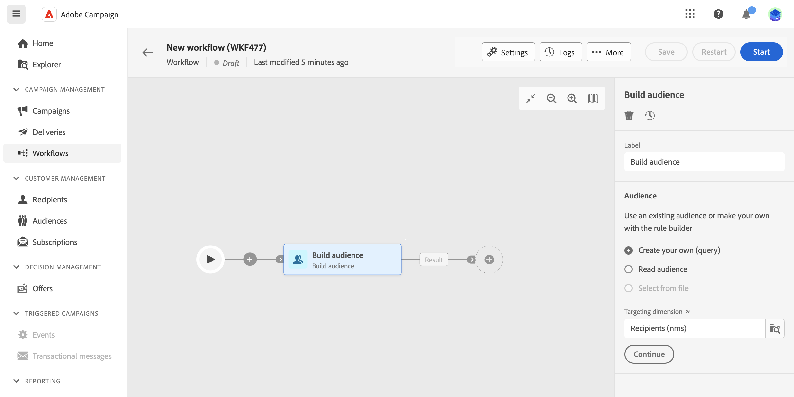

# Creare il primo flusso di lavoro {#create-first-workflow}

>[!CONTEXTUALHELP]
>id="acw_workflow_creation_properties"
>title="Proprietà del flusso di lavoro"
>abstract="TBD"

## Creare il flusso di lavoro {#create}

Il primo passaggio per creare il flusso di lavoro in Campaign v8 Web consiste nel crearlo come flusso di lavoro autonomo o direttamente all’interno di una campagna e nel definirne le proprietà generali. Per farlo, esegui questi passaggi:

1. Per prima cosa, puoi decidere se creare un flusso di lavoro autonomo o integrarlo direttamente all’interno di una campagna:

   * **Flusso di lavoro autonomo**: vai al menu Flussi di lavoro e fai clic sul pulsante Crea flusso di lavoro nell’angolo in alto a destra.
   * **Flusso di lavoro della campagna:** Passa al menu Campagne e apri la campagna in cui desideri creare un nuovo flusso di lavoro. Fai clic sul pulsante Crea flusso di lavoro nell’angolo superiore destro della scheda Flussi di lavoro.

   Viene visualizzata la finestra di dialogo Proprietà flusso di lavoro.

   

1. Seleziona il modello da utilizzare per creare il flusso di lavoro e fornisci un’etichetta per il flusso di lavoro.

   I modelli di flusso di lavoro contengono attività preconfigurate e configurazioni di proprietà generali che possono essere riutilizzate per creare nuovi flussi di lavoro. Vengono creati dalla console client. [Scopri come utilizzare i modelli](https://experienceleague.adobe.com/docs/campaign/automation/workflows/introduction/build-a-workflow.html#workflow-templates)

1. Espandi la sezione Opzioni aggiuntive se desideri configurare impostazioni specifiche per il flusso di lavoro, ad esempio la cartella di archiviazione e il fuso orario. [Scopri come configurare le proprietà del flusso di lavoro](workflow-settings.md)

1. Fai clic sul pulsante Crea flusso di lavoro per confermare la creazione del flusso di lavoro.

Una volta creato il flusso di lavoro, puoi iniziare a orchestrare le varie attività che eseguirà utilizzando un’area di lavoro visiva dedicata. [Scopri come orchestrare le attività del flusso di lavoro](#build)

## Orchestrare le attività del flusso di lavoro {#build}

Una volta che hai [ha creato un flusso di lavoro](create-workflow.md), dal menu del flusso di lavoro o all’interno di una campagna, puoi iniziare a orchestrare le diverse attività che eseguirà. A questo scopo, viene fornita un’area di lavoro visiva che consente di creare un diagramma di flusso di lavoro. All’interno di questo diagramma, puoi aggiungere varie attività e collegarle in ordine sequenziale.

In questa fase della configurazione, il diagramma viene visualizzato con un’icona iniziale che rappresenta l’inizio del flusso di lavoro. Per aggiungere la prima attività, fai clic sul pulsante + collegato all’icona Start.

Viene visualizzato un elenco di attività che possono essere aggiunte al diagramma. Le attività disponibili dipendono dalla posizione all’interno del diagramma del flusso di lavoro. Ad esempio, quando aggiungi la prima attività, puoi avviare il flusso di lavoro eseguendo il targeting di un pubblico, suddividendo il percorso del flusso di lavoro o impostando un’attività Attendi per ritardare l’esecuzione del flusso di lavoro. D’altra parte, dopo un’attività Genera pubblico, puoi perfezionare il target con le attività di targeting, inviare una consegna al pubblico con le attività del canale o organizzare il processo di flusso di lavoro con le attività di controllo del flusso.

Una volta aggiunta un’attività al diagramma, viene visualizzato un riquadro a destra che consente di configurare l’attività appena aggiunta con impostazioni specifiche. Informazioni dettagliate su come configurare ogni attività sono disponibili in [questa sezione](activities/about-activities.md).

Ripeti questo processo aggiungendo tutte le attività desiderate in base alle attività che desideri che il flusso di lavoro esegua. Puoi anche inserire una nuova attività tra due attività. A questo scopo, fai clic sul pulsante + sulla transizione tra le attività, seleziona l’attività desiderata e configurala nel riquadro a destra.

Per rimuovere un’attività, selezionala nell’area di lavoro e fai clic sull’icona Elimina nelle proprietà dell’attività.

>[!TIP]
>
>Hai la possibilità di personalizzare il nome delle transizioni tra ciascuna attività. A questo scopo, seleziona la transizione e modifica la relativa etichetta nel riquadro a destra.

Dopo aver completato il flusso di lavoro, aggiungi un’attività Fine alla fine del diagramma. Questa attività ti consente di contrassegnare visivamente la fine di un flusso di lavoro e non ha alcun impatto funzionale.

Dopo aver progettato correttamente il diagramma del flusso di lavoro, è possibile eseguirlo e tenere traccia dell&#39;avanzamento delle varie attività. [Scopri come avviare un flusso di lavoro e monitorarne l’esecuzione](start-monitor-workflows.md)
