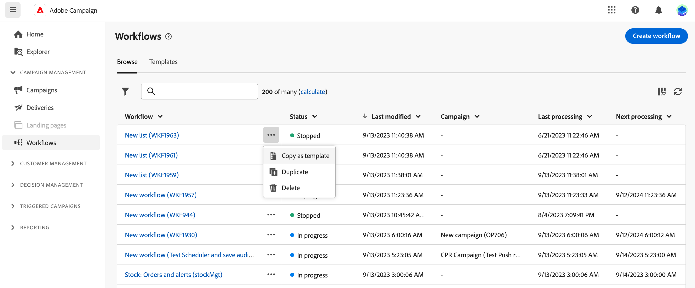
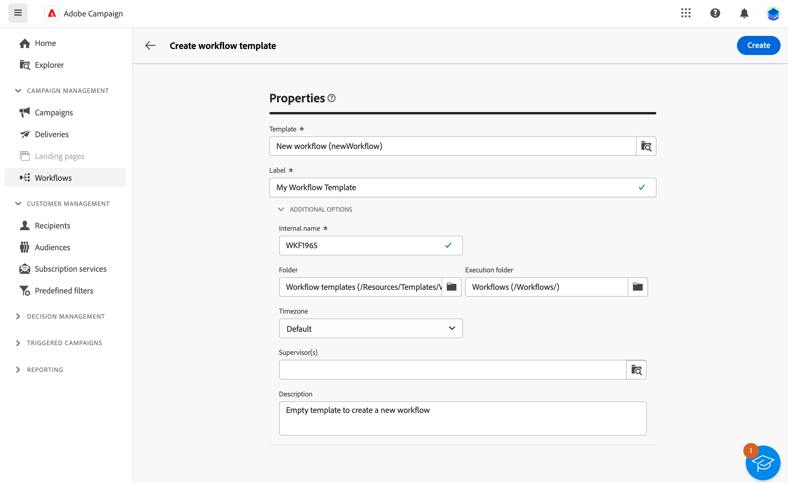

# Creare il flusso di lavoro {#create-first-workflow}

>[!CONTEXTUALHELP]
>id="acw_workflow_creation_properties"
>title="Proprietà del flusso di lavoro"
>abstract="In questa schermata, scegli il modello da utilizzare per creare il flusso di lavoro e specifica un’etichetta. Espandere la sezione OPTIONS AGGIUNTIVI per configurare altre impostazioni quali il nome interno del flusso di lavoro, la relativa cartella, il fuso orario e il gruppo di supervisori. Si consiglia vivamente di selezionare un gruppo di supervisori in modo che gli operatori vengano avvisati in caso di errore."

>[!CONTEXTUALHELP]
>id="acw_campaign_creation_workflow"
>title="Elenco dei flussi di lavoro nella campagna"
>abstract="Il **Consegne** nella scheda sono elencati tutti i flussi di lavoro collegati alla campagna corrente. Fai clic sul nome di un flusso di lavoro per modificarlo. Utilizza il pulsante Crea flusso di lavoro per aggiungere un nuovo flusso di lavoro per questa campagna."

Puoi creare flussi di lavoro autonomi o flussi di lavoro all’interno di una campagna. Il primo passaggio consiste nel selezionare un modello e definirne le proprietà generali. Puoi quindi configurare altre impostazioni in base alle esigenze.

Per farlo, segui questi passaggi:

1. Per creare un **Flusso di lavoro autonomo**, passare alla **Flussi di lavoro** menu.

   Per creare un **Flusso di lavoro della campagna**, passare alla **Campagne** e aprire la campagna per la quale si desidera creare un nuovo flusso di lavoro.

1. Fai clic su **[!UICONTROL Crea flusso di lavoro]** nell&#39;angolo superiore destro dello schermo.

   

1. Nel flusso di lavoro **Proprietà** nella finestra di dialogo, seleziona il modello da utilizzare per creare il flusso di lavoro (puoi anche utilizzare il modello predefinito incorporato). Ulteriori informazioni sui modelli in [la sezione seguente](#work-with-workflow-templates-workflow-templates).

1. Immetti un’etichetta per il flusso di lavoro. Inoltre, si consiglia vivamente di aggiungere una descrizione al flusso di lavoro, nel campo dedicato del **[!UICONTROL Opzioni aggiuntive]** sezione della schermata.

1. Espandi **[!UICONTROL Opzioni aggiuntive]** per configurare altre impostazioni per il flusso di lavoro. Scopri come configurare le proprietà del flusso di lavoro in [questa pagina](workflow-settings.md#properties)

   

1. Fai clic sul pulsante **[!UICONTROL Crea flusso di lavoro]** per confermare la creazione del flusso di lavoro.

Il flusso di lavoro viene ora creato e disponibile nell’elenco dei flussi di lavoro. Ora puoi accedere alla relativa area di lavoro visiva e iniziare ad aggiungere, configurare e orchestrare le attività che eseguirà. Scopri come orchestrare le attività del flusso di lavoro in [questa pagina](orchestrate-activities.md).

## Utilizzare i modelli di workflow {#workflow-templates}

I modelli di flusso di lavoro contengono impostazioni e attività preconfigurate che possono essere riutilizzate per creare nuovi flussi di lavoro. Durante la creazione di un flusso di lavoro, è possibile selezionare il modello del flusso di lavoro dalle relative proprietà. Per impostazione predefinita, viene fornito un modello vuoto.

Puoi creare un modello da un flusso di lavoro esistente o crearne uno nuovo da zero. Entrambi i metodi sono descritti di seguito.

>[!BEGINTABS]

>[!TAB Creare un modello da un flusso di lavoro esistente]

Per creare un modello di workflow da un workflow esistente, effettuare le seguenti operazioni:

1. Apri per **Flussi di lavoro** e passa al flusso di lavoro per salvarlo come modello.
1. Fai clic sui tre punti a destra del nome del flusso di lavoro e scegli **Copia come modello**.

   

1. Nella finestra pop-up, conferma la creazione del modello.
1. Nell’area di lavoro del modello di flusso di lavoro, seleziona, aggiungi e configura le attività in base alle esigenze.
1. Accedi alle impostazioni dalla scheda **Impostazioni** per modificare il nome del modello di workflow e immettere una descrizione.
1. Seleziona la **cartella** e **cartella di esecuzione** del modello. La cartella è il percorso in cui viene salvato il modello di workflow. La cartella di esecuzione è la cartella in cui vengono salvati i flussi di lavoro creati in base a questo modello.

   

   Le altre proprietà sono comuni ai flussi di lavoro. Per ulteriori informazioni, consulta [questa pagina](workflow-settings.md#properties)

1. Salva le modifiche.

Il modello di workflow è ora disponibile nell&#39;elenco dei modelli. Puoi creare un flusso di lavoro basato su questo modello. Questo flusso di lavoro sarà preconfigurato con le impostazioni e le attività definite nel modello.

>[!TAB Creare un modello da zero]

Per creare un modello di flusso di lavoro da zero, effettua le seguenti operazioni:

1. Apri per **Flussi di lavoro** e passare al menu **Modelli** scheda. Puoi visualizzare l’elenco dei modelli di flusso di lavoro disponibili.
1. Fai clic su **[!UICONTROL Crea modello]** nell&#39;angolo superiore destro dello schermo.
1. Immettere l&#39;etichetta e aprire le opzioni aggiuntive per immettere una descrizione del modello di workflow.
1. Seleziona la cartella e la cartella di esecuzione del modello. La cartella è il percorso in cui viene salvato il modello di workflow. La cartella di esecuzione è la cartella in cui vengono salvati i flussi di lavoro creati in base a questo modello.

   

   Le altre proprietà sono comuni ai flussi di lavoro. Per ulteriori informazioni, consulta [questa pagina](workflow-settings.md#properties)

1. Fai clic su **Crea** per confermare le impostazioni.
1. Nell’area di lavoro del modello di flusso di lavoro, aggiungi e configura le attività in base alle esigenze.

   

1. Salva le modifiche.

Il modello di workflow è ora disponibile nell&#39;elenco dei modelli. Puoi creare un flusso di lavoro basato su questo modello. Questo flusso di lavoro sarà preconfigurato con le impostazioni e le attività definite nel modello.

>[!ENDTABS]
