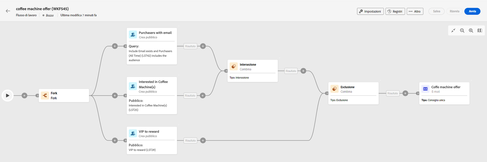

# Principi chiave per la creazione di flussi di lavoro {#gs-workflow-creation}

Con Campaign v8 Web, puoi creare flussi di lavoro in un’area di lavoro visiva per progettare processi cross-channel come la segmentazione, l’esecuzione di campagne e l’elaborazione di file.

I flussi di lavoro possono essere creati come flussi di lavoro autonomi, dal menu Flussi di lavoro o direttamente all’interno di una campagna, nel qual caso il flusso di lavoro verrà collegato alla campagna ed eseguito insieme a tutti gli altri flussi di lavoro della campagna.

## Cosa c’è all’nterno di un flusso di lavoro?

Il diagramma del flusso di lavoro è una rappresentazione di ciò che dovrebbe accadere. Descrive le varie attività da eseguire e il modo in cui vengono collegate tra loro.

Ogni flusso di lavoro contiene:

* **Attività**: un’attività è un’attività da eseguire. Le varie attività disponibili sono rappresentate nel diagramma tramite icone. Ogni attività presenta proprietà specifiche e altre proprietà comuni a tutte le attività.

   In un diagramma del flusso di lavoro, una determinata attività può produrre più attività, in particolare in presenza di un ciclo o di azioni ricorrenti.

* **Transizioni**: le transizioni collegano un’attività di origine a un’attività di destinazione e ne definiscono la sequenza.

* **Tabelle di lavoro**: la tabella di lavoro contiene tutte le informazioni riportate dalla transizione. Ogni flusso di lavoro utilizza diverse tabelle di lavoro. I dati trasmessi in queste tabelle possono essere utilizzati in tutto il ciclo di vita del flusso di lavoro.

## Passaggi principali per creare un flusso di lavoro

I passaggi principali per creare i flussi di lavoro sono i seguenti:

<table style="table-layout:fixed"><tr style="border: 0;">
<td>

<a href="create-workflow.md#create"><strong>Creare il flusso di lavoro</strong>

</td>
<td>

<a href="create-workflow.md#build"><strong>Orchestrare le attività</strong></a>

</td>
<td>

<a href="workflow-settings.md"><strong>Configurare le impostazioni avanzate (facoltativo)</strong></a>

</td>
<td>

<a href="start-monitor-workflows.md"><strong>Avviare e monitorare l’esecuzione del flusso di lavoro</strong></a>

</td>
</tr></table>