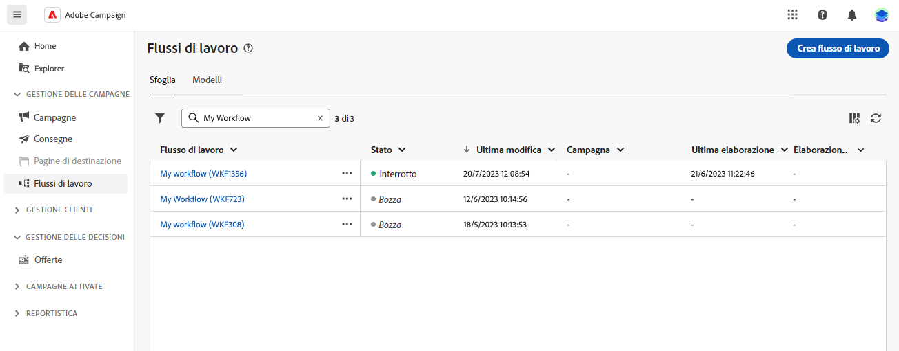
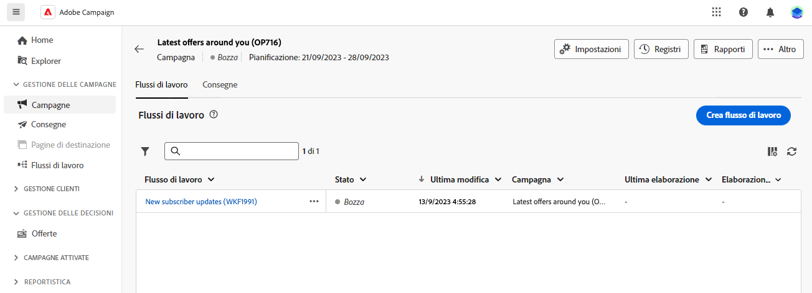

# Principi chiave per la creazione di flussi di lavoro {#gs-workflow-creation}

Con Adobe Campaign Web, puoi creare flussi di lavoro in un’area di lavoro visiva per progettare processi cross-channel come la segmentazione, l’esecuzione di campagne e l’elaborazione di file.

## Cosa c’è all’nterno di un flusso di lavoro? {#gs-workflow-inside}

Il diagramma del flusso di lavoro è una rappresentazione di ciò che dovrebbe accadere. Descrive le varie attività da eseguire e il modo in cui vengono collegate tra loro.

{zoomable=&quot;yes&quot;} {zoomable=&quot;yes&quot;}

Ogni flusso di lavoro contiene:

* **Attività**: un’attività è un’attività da eseguire. Le varie attività disponibili sono rappresentate nel diagramma tramite icone. Ogni attività presenta proprietà specifiche e altre proprietà comuni a tutte le attività.

  In un diagramma del flusso di lavoro, una determinata attività può produrre più attività, in particolare in presenza di un ciclo o di azioni ricorrenti.

* **Transizioni**: le transizioni collegano un’attività di origine a un’attività di destinazione e ne definiscono la sequenza.

* **Tabelle di lavoro**: la tabella di lavoro contiene tutte le informazioni riportate dalla transizione. Ogni flusso di lavoro utilizza diverse tabelle di lavoro. I dati trasmessi in queste tabelle possono essere utilizzati in tutto il ciclo di vita del flusso di lavoro.

## Passaggi chiave per creare un flusso di lavoro {#gs-workflow-steps}

Campaign offre due modi per creare un flusso di lavoro:

1. I flussi di lavoro possono essere creati come flussi di lavoro autonomi dal menu **Flussi di lavoro**.

   {zoomable=&quot;yes&quot;}

1. I flussi di lavoro possono essere creati direttamente all’interno di una campagna, dalla scheda **Flusso di lavoro** della campagna. Quando è incluso in una campagna, il flusso di lavoro viene eseguito insieme a tutti gli altri flussi di lavoro della campagna e le metriche di reporting sono tutte raggruppate a livello di campagna.

   {zoomable=&quot;yes&quot;}

I passaggi chiave per creare i flussi di lavoro sono i seguenti:

{zoomable=&quot;yes&quot;}

Questi passaggi sono descritti nella sezione seguente:

1. [Creare il flusso di lavoro e definirne le proprietà](create-workflow.md)
1. [Orchestrare e configurare le attività](orchestrate-activities.md)
1. [Configurare le impostazioni avanzate del flusso di lavoro](workflow-settings.md)
1. [Avviare il flusso di lavoro e monitorarne l’esecuzione](start-monitor-workflows.md)
