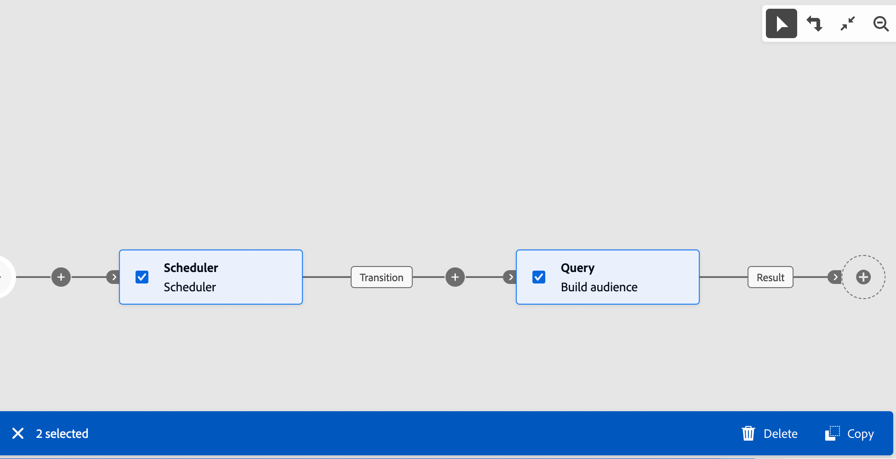

# Orchestrare le attività {#orchestrate}

Dopo aver [creato un flusso di lavoro](create-workflow.md), dal menu del flusso di lavoro o all’interno di una campagna, puoi iniziare a orchestrare le diverse attività che eseguirà. A questo scopo, viene fornita un’area di lavoro visiva che consente di creare un diagramma del flusso di lavoro. All’interno di questo diagramma, puoi aggiungere varie attività e collegarle in ordine sequenziale.

## Aggiungere attività {#add}

In questa fase della configurazione, il diagramma viene visualizzato con un’icona di avvio che rappresenta l’inizio del flusso di lavoro. Per aggiungere la prima attività, fare clic sul pulsante **+** connesso all&#39;icona Start.

Viene visualizzato un elenco di attività che possono essere aggiunte al diagramma. Le attività disponibili dipendono dalla posizione all’interno del diagramma del flusso di lavoro. Ad esempio, quando aggiungi la prima attività, puoi avviare il flusso di lavoro eseguendo il targeting di un pubblico, suddividendo il percorso del flusso di lavoro o impostando un&#39;attività **Attendi** per ritardare l&#39;esecuzione del flusso di lavoro. Al contrario, dopo un&#39;attività di **Generazione pubblico**, puoi perfezionare il target con le attività di targeting, inviare una consegna al pubblico con le attività del canale o organizzare il processo di flusso di lavoro con le attività di controllo del flusso.

{zoomable="yes"}

Una volta aggiunta un’attività al diagramma, viene visualizzato un riquadro a destra che consente di configurare l’attività appena aggiunta con impostazioni specifiche. Informazioni dettagliate su come configurare ogni attività sono disponibili in [questa sezione](activities/about-activities.md).

{zoomable="yes"}

Ripeti questo processo per aggiungere tutte le attività desiderate, a seconda delle attività da eseguire nel flusso di lavoro. Puoi anche inserire una nuova attività tra due attività. A tale scopo, fare clic sul pulsante **+** sulla transizione tra le attività, selezionare l&#39;attività desiderata e configurarla nel riquadro di destra.

Per rimuovere un&#39;attività, selezionarla nell&#39;area di lavoro e fare clic sull&#39;icona **Elimina** nelle proprietà dell&#39;attività.

>[!TIP]
>
>Hai la possibilità di personalizzare il nome delle transizioni tra ciascuna attività. A questo scopo, seleziona la transizione e modifica la relativa etichetta nel riquadro a destra.

## Barra degli strumenti {#toolbar}

La barra degli strumenti situata nell’angolo superiore destro dell’area di lavoro offre opzioni per manipolare facilmente le attività e navigare nell’area di lavoro:

* **Modalità di selezione multipla**: selezionare più attività per eliminarle tutte contemporaneamente oppure copiarle e incollarle. Consulta [questa sezione](#copy).
* **Ruota**: cambia l&#39;area di lavoro verticalmente.
* **Adatta allo schermo**: adatta il livello di zoom dell&#39;area di lavoro allo schermo.
* **Zoom indietro** / **Zoom avanti**: Zoom indietro o nell&#39;area di lavoro.
* **Mappa di visualizzazione**: apre uno snapshot dell&#39;area di lavoro che mostra che ci si trova.

{zoomable="yes"}{width="50%"}

## Gestire le attività {#manage}

Quando si aggiungono attività, nel riquadro delle proprietà sono disponibili pulsanti di azione che consentono di eseguire più operazioni.

{zoomable="yes"}

Puoi eseguire le seguenti azioni:

* **Elimina** l’attività dall’area di lavoro.
* **Disattiva/Attiva** l’attività. Quando il flusso di lavoro viene eseguito, le attività disabilitate e le attività successive sullo stesso percorso non vengono eseguite e il flusso di lavoro viene interrotto.
* **Pausa/Riprendi** l’attività. Quando il flusso di lavoro viene eseguito, viene messo in pausa in corrispondenza dell’attività in pausa. L’attività corrispondente e tutte quelle che la seguono nello stesso percorso non vengono eseguite.
* **Copia** l’attività. Consulta [questa sezione](#copy).
* **Sposta** un&#39;attività e tutti i relativi nodi figlio in un&#39;altra transizione. Vedi [questa sezione](#move)
* Accedi alle **opzioni di esecuzione** dell&#39;attività.
* Accedi a **Registri e attività**.

Diverse attività di **targeting**, come **Combina** o **Deduplicazione**, ti consentono di elaborare il gruppo rimanente e includerlo in un&#39;ulteriore transizione in uscita. Ad esempio, se utilizzi un&#39;attività **Split**, il complemento è costituito dal gruppo che non corrisponde a nessuno dei sottoinsiemi definiti in precedenza. Per utilizzare questa funzionalità, attivare l&#39;opzione **Genera complemento**.

## Spostare o copiare attività {#move-copy}

### Attività di copia e incolla {#copy}

Puoi copiare le attività del flusso di lavoro e incollarle in qualsiasi flusso di lavoro. Il flusso di lavoro di destinazione può trovarsi in una scheda del browser diversa.

Per copiare le attività, puoi scegliere tra due opzioni:

* copia un’attività utilizzando il pulsante azione.

  {zoomable="yes"}{width="70%"}

* copia più attività utilizzando il pulsante della barra degli strumenti.

  {zoomable="yes"}{width="70%"}

Per incollare le attività copiate, fare clic sul pulsante **+** su una transizione e selezionare &quot;Incolla attività X&quot;.

{zoomable="yes"}{width="50%"}

### Spostare le attività e i relativi nodi figlio {#move}

Journey Optimizer consente di spostare un’attività, insieme all’intero contenuto dei relativi nodi secondari (incluse tutte le transizioni e le attività al suo interno), alla fine di un’altra transizione all’interno dello stesso flusso di lavoro.

Questo processo disconnette l’attività e tutto ciò che si trova nella sua transizione in uscita dalla posizione iniziale, spostandola nella nuova transizione di destinazione.

Per spostare un’attività:

1. Seleziona l’attività da spostare.
1. Nel riquadro delle proprietà dell&#39;attività fare clic sul pulsante **Sposta**.
1. Seleziona la transizione in cui desideri inserire l’attività e la relativa transizione in uscita, quindi conferma.

## Execution options {#execution}

Tutte le attività ti consentono di gestire le relative opzioni di esecuzione. Seleziona un&#39;attività e fai clic sul pulsante **Opzioni di esecuzione**. Questo ti consente di definire la modalità di esecuzione dell’attività e il comportamento in caso di errori.

{zoomable="yes"}{width="70%"}

### Properties

Il campo **Esecuzione** consente di definire l&#39;azione da eseguire all&#39;avvio dell&#39;attività.

Il campo **Durata massima esecuzione** consente di specificare una durata, ad esempio &quot;30s&quot; o &quot;1h&quot;. Se l’attività non viene completata dopo la scadenza della durata specificata, viene attivato un avviso. Questo non ha alcun impatto sul funzionamento del flusso di lavoro.

Il campo **Fuso orario** consente di selezionare il fuso orario dell&#39;attività. Adobe Campaign consente di gestire le differenze di tempo tra più paesi nella stessa istanza. L’impostazione applicata viene configurata al momento della creazione dell’istanza.

**Il campo Affinità** consente di forzare l&#39;esecuzione di un flusso di lavoro o di un&#39;attività del flusso di lavoro in un computer specifico. A questo scopo, devi specificare una o più affinità per il flusso di lavoro o l’attività in questione.

Il campo **Comportamento** consente di definire la procedura da seguire se vengono utilizzate attività asincrone.

### Gestione degli errori

Il campo **In caso di errore** consente di specificare l&#39;azione da eseguire in caso di errore dell&#39;attività.

### Script di inizializzazione

Lo script di inizializzazione **** consente di inizializzare le variabili o modificare le proprietà dell&#39;attività. Fare clic sul pulsante **Modifica codice** e digitare il frammento di codice da eseguire. Lo script viene chiamato durante l’esecuzione dell’attività. Consulta la sezione relativa a [variabili evento](../workflows/event-variables.md).

## Esempio {#example}

Di seguito è riportato un esempio di flusso di lavoro progettato per inviare un’e-mail ai clienti (diversi da clienti VIP) che hanno un’email e sono interessati alle macchine da caffè.

{zoomable="yes"}{zoomable="yes"}

A questo scopo, sono state aggiunte le seguenti attività:

* Un’attività **[!UICONTROL Fork]** che divide il flusso di lavoro in tre percorsi (uno per ogni set clienti),
* Attività **[!UICONTROL Creazione del pubblico]** per eseguire il targeting dei tre set clienti:

   * Clienti con un’e-mail,
   * Clienti appartenenti al pubblico “Interessati alle macchine da caffè” preesistente,
   * Clienti appartenenti al pubblico “VIP o premio” preesistente.

* Un’attività **[!UICONTROL Combina]** che raggruppa i clienti con un’e-mail e quelli interessati alle macchine da caffè,
* Un’attività **[!UICONTROL Combina]** che esclude clienti VIP,
* Un’attività **[!UICONTROL Consegna e-mail]** che invia un’e-mail ai clienti risultanti.

Dopo aver completato il flusso di lavoro, aggiungi l’attività **[!UICONTROL Fine]** alla fine del diagramma. Questa attività ti consente di contrassegnare visivamente la fine di un flusso di lavoro e non ha alcun impatto funzionale.

Dopo aver progettato correttamente il diagramma del flusso di lavoro, è possibile eseguirlo e tenere traccia dell’avanzamento delle varie attività. [Scopri come avviare un flusso di lavoro e monitorarne l’esecuzione](start-monitor-workflows.md)
