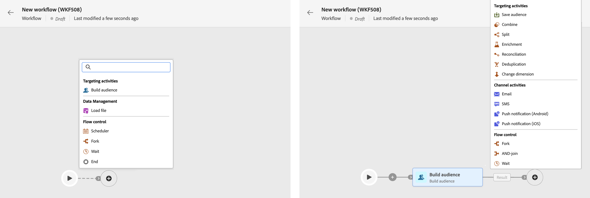
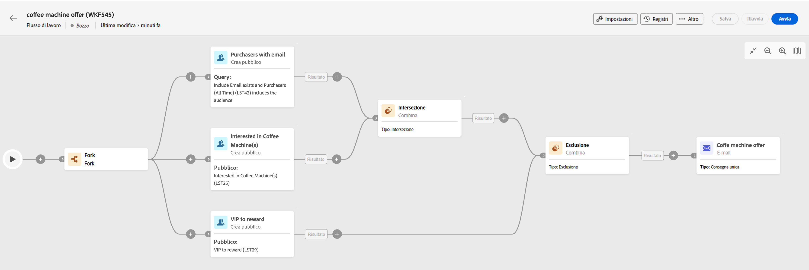

# Orchestrare le attività {#orchestrate}

Dopo aver [creato un flusso di lavoro](create-workflow.md), dal menu del flusso di lavoro o all’interno di una campagna, puoi iniziare a orchestrare le diverse attività che eseguirà. A questo scopo, viene fornita un’area di lavoro visiva che consente di creare un diagramma del flusso di lavoro. All’interno di questo diagramma, puoi aggiungere varie attività e collegarle in ordine sequenziale.

In questa fase della configurazione, il diagramma viene visualizzato con un’icona di avvio che rappresenta l’inizio del flusso di lavoro. Per aggiungere la prima attività, fai clic sul pulsante + collegato all’icona di avvio.

Viene visualizzato un elenco di attività che possono essere aggiunte al diagramma. Le attività disponibili dipendono dalla posizione all’interno del diagramma del flusso di lavoro. Ad esempio, quando aggiungi la prima attività, puoi avviare il flusso di lavoro eseguendo il targeting di un pubblico, suddividendo il percorso del flusso di lavoro o impostando un’attività Attendi per ritardare l’esecuzione del flusso di lavoro. D’altra parte, dopo un’attività Creazione del pubblico, puoi perfezionare il target con le attività di targeting, inviare una consegna al pubblico con le attività del canale o organizzare il processo di flusso di lavoro con le attività di controllo del flusso.

Una volta aggiunta un’attività al diagramma, viene visualizzato un riquadro a destra che consente di configurare l’attività appena aggiunta con impostazioni specifiche. Informazioni dettagliate su come configurare ogni attività sono disponibili in [questa sezione](activities/about-activities.md).

Ripeti questa procedura aggiungendo tutte le attività desiderate in base alle attività che desideri siano eseguite dal flusso di lavoro. Puoi anche inserire una nuova attività tra due attività. A questo scopo, fai clic sul pulsante + sulla transizione tra le attività, seleziona l’attività desiderata e configurala nel riquadro a destra.

Per rimuovere un’attività, selezionala nell’area di lavoro e fai clic sull’icona Elimina nelle proprietà dell’attività.

>[!TIP]
>
>Hai la possibilità di personalizzare il nome delle transizioni tra ciascuna attività. A questo scopo, seleziona la transizione e modifica la relativa etichetta nel riquadro a destra.

Di seguito è riportato un esempio di flusso di lavoro progettato per inviare un’e-mail ai clienti (diversi da clienti VIP) che hanno un’email e sono interessati alle macchine da caffè.

A questo scopo, sono state aggiunte le seguenti attività:

* Un’attività **[!UICONTROL Fork]** che divide il flusso di lavoro in tre percorsi (uno per ogni set clienti),
* Attività **[!UICONTROL Creazione del pubblico]** per eseguire il targeting dei tre set clienti:

   * Clienti con un’e-mail,
   * Clienti appartenenti al pubblico “Interessati alle macchine da caffè” preesistente,
   * Clienti appartenenti al pubblico “VIP o premio” preesistente.

* Un’attività **[!UICONTROL Combina]** che raggruppa i clienti con un’e-mail e quelli interessati alle macchine da caffè,
* Un’attività **[!UICONTROL Combina]** che esclude clienti VIP,
* Un’attività **[!UICONTROL Consegna e-mail]** che invia un’e-mail ai clienti risultanti.

Dopo aver completato il flusso di lavoro, aggiungi l’attività **[!UICONTROL Fine]** alla fine del diagramma. Questa attività ti consente di contrassegnare visivamente la fine di un flusso di lavoro e non ha alcun impatto funzionale.

Dopo aver progettato correttamente il diagramma del flusso di lavoro, è possibile eseguirlo e tenere traccia dell’avanzamento delle varie attività. [Scopri come avviare un flusso di lavoro e monitorarne l’esecuzione](start-monitor-workflows.md)
