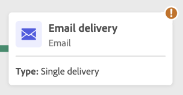

# Avviare e monitorare i flussi di lavoro {#start-monitor}

Dopo aver creato il flusso di lavoro e progettato le attività da eseguire nell’area di lavoro, puoi avviarne l’esecuzione e monitorarne la modalità di esecuzione.

## Avviare il flusso di lavoro {#start}

Per avviare il flusso di lavoro, passa a **[!UICONTROL Flussi di lavoro]** o alla campagna associata e fai clic sul pulsante **[!UICONTROL Avvia]** nell’angolo superiore a destra dell’area di lavoro.

Una volta eseguito il flusso di lavoro, ogni attività nell’area di lavoro viene eseguita in ordine sequenziale, fino al raggiungimento della fine del flusso di lavoro.

Puoi monitorare l’avanzamento dei profili target in tempo reale utilizzando un flusso visivo. Questo consente di identificare rapidamente lo stato di ciascuna attività e il numero di profili che passano da un’attività all’altra.

## Transizioni del flusso di lavoro {#transitions}

Nei flussi di lavoro, i dati trasportati da un’attività all’altra tramite transizioni vengono memorizzati in una tabella di lavoro temporanea. Questi dati possono essere visualizzati per ogni transizione. A questo scopo, seleziona una transizione per aprirne le proprietà sul lato destro dello schermo.

* Fai clic su **[!UICONTROL Anteprima schema]** per visualizzare lo schema della tabella di lavoro.
* Fai clic su **[!UICONTROL Anteprima risultati]** per visualizzare i dati trasportati nella transizione selezionata.

## Monitorare l’esecuzione dell’attività {#activities}

Gli indicatori visivi nell’angolo superiore a destra di ciascuna casella di attività ti consentono di controllarne l’esecuzione:

| Indicatore visivo | Descrizione |
|-----|------------|
| {width="70%"} | L’attività è attualmente in esecuzione. |
| {width="70%"} | L’attività richiede la tua attenzione. Ciò potrebbe implicare la conferma dell’invio di una consegna o l’adozione di un’azione necessaria. |
| {width="70%"} | L’attività ha rilevato un errore. Per risolvere il problema, apri i registri del flusso di lavoro per ulteriori informazioni. |
| {width="70%"} | L’attività è stata eseguita correttamente. |

## Monitorare i registri e le attività {#logs-tasks}

Il monitoraggio dei registri e delle attività dei flussi di lavoro è un passaggio chiave per analizzare i flussi di lavoro e assicurarsi che vengano eseguiti correttamente. Sono accessibili dall’icona **[!UICONTROL Registri]** disponibile nella barra degli strumenti delle azioni e nel riquadro delle proprietà di ogni attività.

Il menu **[!UICONTROL Registri e attività]** fornisce una cronologia dell’esecuzione del flusso di lavoro, registrando tutte le azioni dell’utente e gli errori riscontrati. Questa cronologia viene salvata per la durata specificata nelle [opzioni di esecuzione](workflow-settings.md) del flusso di lavoro. Durante questo periodo, tutti i messaggi vengono salvati, anche dopo che il flusso di lavoro è stato riavviato. Se non desideri salvare i messaggi di un’esecuzione precedente, fai clic sul pulsante **[!UICONTROL Elimina cronologia]**.

Sono disponibili due tipi di informazioni:

* La scheda **[!UICONTROL Registro]** contiene la cronologia di esecuzione di tutte le attività del flusso di lavoro. Questi registri indicizzano in ordine cronologico le operazioni effettuate e gli errori di esecuzione.
* Nella scheda **[!UICONTROL Attività]** viene illustrata la sequenza di esecuzione delle attività.

In entrambe le schede, puoi scegliere le colonne visualizzate e il loro ordine, applicare filtri e utilizzare il campo di ricerca per trovare rapidamente le informazioni desiderate.

## Comandi di esecuzione del flusso di lavoro {#execution-commands}

La barra delle azioni nell’angolo in alto a destra fornisce comandi che consentono di gestire l’esecuzione del flusso di lavoro. Puoi:

* **[!UICONTROL Avviare]** / **[!UICONTROL Riprendere]** l’esecuzione del flusso di lavoro, che assume quindi lo stato In corso. Se il flusso di lavoro è stato messo in pausa, viene ripristinato, altrimenti viene avviato e le attività iniziali vengono quindi attivate.

* **[!UICONTROL Mettere in pausa]** l’esecuzione del flusso di lavoro, che assume quindi lo stato In pausa. Non verranno attivate nuove attività finché non viene ripresa, ma le operazioni in corso non vengono sospese.

* **[!UICONTROL Interrompere]** un flusso di lavoro in esecuzione che assume lo stato Completato. Se possibile, le operazioni in corso vengono interrotte. Non è possibile riprendere dal flusso di lavoro dalla stessa posizione in cui è stato interrotto.
